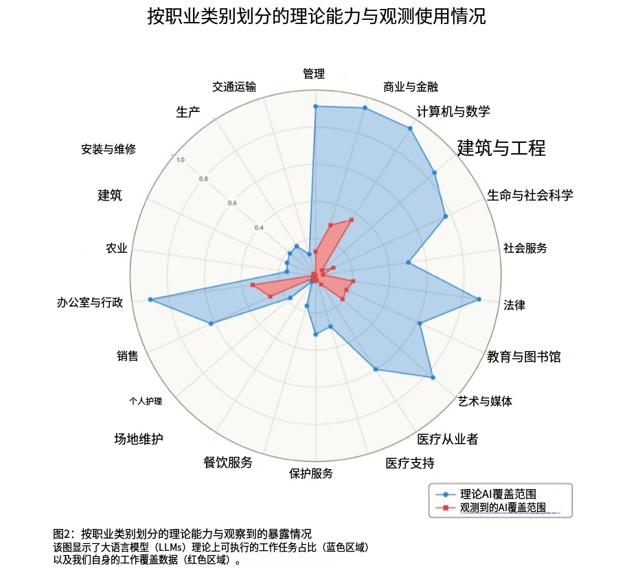

### AI热浪下的冷静思考：为什么大多数人都被误导了

当下，AI话题席卷网络，各种声音都在强调：不跟上潮流，就会被淘汰。

随之而来的是大量课程推销者，他们声称：购买课程、抓住机遇，通过AI实现盈利，制作AI漫画、AI视频等内容，仿佛投资课程就能轻松获利。

但这种想法存在明显缺陷。仅凭一个AI工具，缺乏其他生产要素，就想实现盈利，这并不现实。

这些课程销售者采用的策略始终如一：就像之前宣传错过短视频红利、错过黄金投资机会一样，现在只是将宣传包装换成了AI概念。

他们会告诉你："你错过了短视频、错过了黄金、错过了各种机会，不要再错过AI！抓住这次翻身机会，否则将永远失去！"

然后按照熟悉的套路继续："你的认知水平不足，无法获得认知范围之外的收益！购买我的课程、会员，观看直播学习AI，否则此生再无机会！"

放你妈的屁。

但实际情况并非如此。

### AI风口与普通个体无关

鹏星想把这套忽悠人的把戏秒杀到极致，就四个大字：  **与你无关** 。

现在零零后会经常说：

"你们那个年代到处都是机会，改革开放时期下海经商就能赚钱，房价低廉时不买房，学历有价值时不重视读书，一辈子贫穷，这不是失败又是什么？自己不行还怪别人！！！"

换成现在的说法，同样难听：

"现在的机会更多，AI爆发、短视频兴起、黄金上涨、比特币飙升，直播带货都能盈利，你一个都没抓住，这不是失败又是什么？"

面对这种情况，卖课推销者们再次出现，鼓吹要紧跟时代，现在是站在AI风口上，是个人都能通过AI实现盈利，但这种想法过于天真，就好比一个人背井离乡去大城市上班，被人问为什么不想在这里买房，是不想吗？是没钱。那为什么赚不到钱呢？我TM......

言归正传，现在真正的问题是在于：核心关注点不是AI有多强大，而是利益如何分配？计算资源掌握在谁手中？平台和生产资料归属谁？最终利润流向何处？

你认为自己的疲惫、自己的平庸，是因为没跟上AI风口？大哥，搞笑呢？真正消耗你价值的那个系统，一直在你身后默默运作，从不出声。

深层问题是：当社会结构固化后，个人努力的效果有限。这种格局本身就限制了大多数人的上升通道。就像李白，写的诗已经流传千年了，照样无法跻身权力核心、实现政治理想。是他不够努力吗？不够优秀吗？

当时的社会如同一座坚固的金字塔，顶层牢牢掌控着通往高处的阶梯，底层的攀登者无论多么优秀，都难以逾越世代累积的鸿沟，个人的奋斗在庞大的制度面前如萤火之微。

那些每天被工作消耗、承担房贷房租、需要赡养老人抚养子女、面临降薪裁员风险的人，在时间和精力上已经被现状束缚。这些高压力的工薪阶层，往往具备不错的教育背景和认知水平。

更残酷的现实是，你获得的收入，可能连你创造价值的一小部分都不到。

分享一个私货：去做含有人际交往的事，“AI”这玩意毕竟只是一个术，“情”才是道——技术可以复制，但情感他是一个混沌体，无可替代。现在最新的吹捧的"养龙虾"(openclaw)，这玩意把人的习惯整理为一个可以蒸馏的Skill，只需要消耗token，就可以24小时不间断的干活，然后公司把人辞退，被干掉的同事不是离职了，而是变成token陪伴着你，所以token中文叫"辞员"（词元）

在国内，高端工作岗位刚刚起步，产业链升级还需要很长时间，要与欧美日韩竞争高端产业，道路依然漫长。即使成功，劳动者也未必能拿到等额收益。

此外，近年来，人才市场长期供大于求，大家互相内卷，收入被压在低位。、但这还不是重点——居民部门和企业部门，分享的也只是一小块蛋糕，你们俩在那抢来抢去，根本没什么意义。那真正的大蛋糕，去哪了？

美国总人口3~4亿，每年移居近千万，作为世界最富裕的国家之一的超级大国，居然还有流浪汉，还会冻死人，正所谓**朱门酒肉臭，路有冻死骨**。分配问题，不可窥探，不可名状。这一切的一切，都是结构性常态，不是靠提升个认知、买个课、会用个AI，就能整体摆脱的。

那些宣传风口的博主，本质上是在制造虚假希望，让不同阶层的人相互指责，他们从中获得流量，同时帮助既得利益者维持现状。

有人将AI描述为新一轮工业革命，声称能让所有人受益，这话纯属扯淡。

AI和蒸汽机、流水线一样，表面上推动了社会进步，但发生革新的只有效率，而不是生产关系和分配逻辑。只要资源分配的权利还掌握在既得利益者手时，AI技术的先进程度与其对劳动力的压榨效率成正比。技术飞跃式发展的同时，劳动者的工作强度也在加剧——从前工人下班后至少还有自由时光，如今却出现了下班即卧，甚至要承担过劳猝死的风险。

他们还说，AI是新时代的改革开放，遍地都是机会，这更是放屁。

改革开放初期，产业空白、市场缺口众多，确实是真正的增量时代。大家都能获利，不仅因为分配比例，更因为整体规模扩大——即使比例不变，基数增加，个人获得的份额也会增长。

现在的情况完全不同：每个领域都已饱和，平台被巨头垄断，规则早已确立。大部分利润已被瓜分，新进入者面临的不是创业机会，而是打工性质的工作。

那些宣传"抓住风口实现逆袭"的故事，很少是真正的白手起家，大多是误导性的宣传。是不是真英雄去股市走走。

### AI如何使用

那么，AI风口是否完全虚假？

也不是。AI确实有用，但使用方式很重要。

对于真正有实力的群体：真正抓住AI机会的，遵循八字原则——**业务优先，工具辅助**。

市场上有很多关于AI的炒作，但购买课程真的能解决问题吗？

最终人们会发现，那些需要专门学习、部署、建立工作流程的事情，普通人根本用不上。而日常高频需求，不需要追赶前沿技术，现有AI工具就足够了。

花费大量金钱和精力学习的，对普通人来说，往往是低频且无用的空中楼阁，纯粹浪费时间。

正确的做法是：如果你本身就有具体的业务领域，有实际的工作需求——处理大量数据、跟进客户服务、生产内容、完成交易。这些工作真实且紧迫，AI的介入能显著提升效率、降低成本，这才是真正的价值。

比如，原本需要100名员工，现在60名就足够，效率还翻倍，这才叫务实应用。那些展示"AI赚钱截图"的人，根本没有真正的业务，他们的业务就是让人看到他们赚钱，然后吸引你购买会员或课程。

目前AI风口最确定的受益者，不是AI本身，而是教授别人使用AI的人。真正通过AI裁员降本的企业都在低调操作，而割韭菜的人却大声宣传"抓不住风口就是失败者"。

所以，对普通人而言，AI只是一个智能助手——仅此而已。它是你不想做的工作的辅助工具，就像洗衣机一样。

洗衣机解放了双手，AI解放了部分脑力。你不会因为买了洗衣机就觉得抓住了风口，对99.9%的人来说，AI并不能带来发财或翻身的机会。

AI大潮中，学习得越慢、越谨慎，最后可能越会发现，根本不需要刻意学习，因为那是浪费时间。

企业巨头宣传的"颠覆性"功能，几个月后就会被各种应用集成，变成简单的操作功能。

现在看AI语音输入，还有颠覆性吗？不过是点击一下的操作。图像生成、视频制作也是如此，未来的功能，大公司都会为你适配，不会让你去适应技术。

不需要急着去追那些最新、最酷的东西，保持**人渣**态度：我用你，是给你脸了，你还让我学？反了你了！

还有一个流行说法：AI会取代很多工作，人类将失业。

实际情况并非如此：理论上AI可覆盖的岗位很多，但实际覆盖率连理论的十分之一都不到。

> 到底“哪些职业会立刻被替代”，需要看两个层次： 
>
> 【第一层】任务可被 AI 覆盖的技术可能性 AI 作为“通用认知工具”，最先冲击的是信息处理型任务，而不是整个职业名称本身。 
>
> 【第二层】现实经济中的扩散速度 真正决定短期影响的，不只是模型能力，而是产品化程度、企业部署能力、成本收益比、风险承受能力、是否容易嵌入现有流程 短期看，AI 更像是“任务重组工具”； 中期看，才可能变成“岗位结构重塑工具”。
>
>  三句话总结： 
>
> 【1】LLM 对白领、知识型、文本型工作具有很高的理论覆盖能力。 
>
> 【2】现实中的实际使用远低于这种理论能力，说明 adoption 仍滞后。
>
>  【3】AI 的短期影响更像是重塑任务，而不是立刻消灭职业。

听起来头头是道，实际都是空中楼阁。技术可行与实际应用之间存在巨大差距。

AI要在企业落地，需要数据对接、系统集成、合规审查、员工培训、容错机制，每一步都需要成本和精力。技术可行不等于企业能用。

大部分工作不仅涉及信息处理，还包括人际关系处理和物理操作。在商业金融、计算机、法律等信息密集型行业，理论覆盖率虽高，实际却相差很远。

为什么？金融不仅是运行模型，还要陪伴客户、与投资者博弈、进行判断，还有很多手动工作。AI只能替代某个小任务，不能替代整个岗位。

媒体报道"AI替代岗位"，实际上是偷换概念，将"替代任务"说成"替代岗位"。

还有责任问题至今未解决。AI出错，谁承担责任？医疗、法律、社会服务等领域，理论覆盖率不低，实际几乎为零。这些领域出问题，必须有人承担责任，法律不会将责任推给AI模型。

医疗事故判AI全责，你服吗？车祸能算AI全责吗？不可能。媒体的逻辑是“技术牛逼→岗位消失”，但现实是：技术牛逼→产品化→集成→落地工作流→组织变革→监管适配→人改变→岗位重塑。每一步，都要打折扣。

AI真正的力量在于：**它会逐渐消失**。

它会融入生活的每个角落，让你完全感觉不到。拍照自动修图，输入自动联想，想用餐自动下单……你不会觉得"我在使用AI"，就像使用微信不会想到"我在使用即时通讯技术"。

你能想象有人教你使用微信并收费199吗？

微信2011年出来时，全网讨论能不能替代短信，有人喊"风口抓不住就死"。结果呢？它变成了空气，你用它付钱、打车、挂号，从不会想"我要抓微信风口"。纯纯笑话。

AI的终局，就是这样。它不会站在聚光灯下，只会退到幕后，融进每一个APP、每一台电器，嵌进你的每一次操作。AI本来就应该是服务我们，改善我们的生活状态，而不是进一步的增加负担。

**真正的技术革命，是让你忘记技术本身！**

电的发明者不会想到，有一天我们只会关注灯光，而非电流；互联网先驱也不会料到，用户只关心内容，而非协议。AI正在重走这条路：当它好用到无法感知时，就是它最成功的时候。这不是技术的消亡，而是技术的胜利——它终于从"工具"变成了"本能"。

那些把AI架在神坛上的人，最怕AI变成"自来水"——自来水卖不上价。他们要AI保持神秘、保持焦虑，这样才能当二道贩子，一手卖恐惧，一手割韭菜。

**普通人应该怎么办？**

技术的价值在于其效用，而非其象征意义。将AI工具化，恰是对人的主体性的确认。那些神化AI者，实际上是在技术崇拜中迷失了实用主义的智慧。真正的进步，不是拥抱抽象的技术概念，而是在具体情境中解决真实问题。

真正能让你赚钱的，是你擅长、有信息差、家人深耕的领域——只要这个行业还存在机会。利用AI提升效率，才是正确路径。

依靠的不是追逐风口，而是你在某个领域多年积累的经验、踩过的坑、付出的学费，积累的独有经验。用AI优化，哪怕只有一点改进，也比被虚假宣传误导强。

不要东奔西走，专注于自己手中的"底牌"，那些别人不知道的信息和门道，默默努力、悄悄迭代。

事以密成，语以泄败。

AI，只是你的增效工具，不是救生稻草。

本期内容可以自由使用，如果还有博主让你焦虑、催促你买课，直接分享这篇文章即可。

自卑无眠，下一期见。

### 想干AI的电脑配置补充：

应大家需求，整理3档本地AI主机具体配件清单（2026年4月行情，贴合当前硬件涨价趋势，无溢价、不踩坑，避开卖课博主忽悠，**总的来说我不推荐今年买电脑，很急当我没说**），普通人直接照着买就行，不用多花冤枉钱：

**一、入门娱乐档（8000-10000元，普通人首选）**（跑中小型AI模型、语音/轻度视频模型，够用不浪费）

1. CPU：AMD Ryzen 5 7600X（参考价1799元）—— 够用即可，无需高端，避免被忽悠买i9/ Ryzen 9
2. 显卡（核心）：NVIDIA RTX 4070（12GB显存，参考价4299元）—— 本地AI模型核心，支持视频/语音模型加速，2026年价格略有回落，性价比拉满，无需追4090
3. 内存：32GB DDR5 6000MHz（参考价3199元）—— 受2026年内存涨价潮影响，价格较去年翻倍，但32GB是本地模型运行底线，不能省
4. 硬盘：1TB NVMe SSD（参考价899元）—— 存储AI模型文件，当前消费级SSD虽成本倒挂，但1TB刚好够用，无需盲目上2TB
5. 主板：微星B650M-A PRO（参考价899元）—— 中端主板，完美适配CPU，性价比首选
6. 电源：航嘉650W 金牌全模组（参考价499元）—— 稳定供电，避免因电源不足导致显卡报错
7. 机箱+散热：普通风冷+基础机箱（合计399元）—— 无需追求颜值，够用即可

**二、中度实用档（15000-18000元，轻度创作需求）**

1. CPU：AMD Ryzen 7 7800X3D（参考价2999元）—— 多任务处理更流畅，适配中型AI模型并行运行
2. 显卡（核心）：NVIDIA RTX 4080（16GB显存，参考价7999元）—— 视频模型渲染、大模型运行速度翻倍，2026年高端显卡因显存短缺，价格维持高位
3. 内存：64GB DDR5 6400MHz（参考价6299元）—— 应对多模型同时运行+视频素材处理，避免卡顿
4. 硬盘：2TB NVMe SSD（参考价1799元）—— 存储更多AI模型+视频素材，规避频繁删改麻烦
5. 主板：华硕B760M-PLUS（参考价1299元）—— 高端中端主板，稳定性更强
6. 电源：长城750W 金牌全模组（参考价699元）—— 适配高端显卡，稳定不翻车
7. 机箱+散热：塔式风冷+简约机箱（合计699元）—— 散热更好，适配CPU高负载运行

**三、专业进阶档（25000-35000元，专业从业者专用，普通人慎选）**

1. CPU：AMD Ryzen 9 7950X（参考价4599元）—— 顶级消费级CPU，适配海量数据处理+多模型并行
2. 显卡（核心）：NVIDIA RTX 4090（24GB显存，参考价15999元）—— 本地大模型+高清视频模型底线配置，2026年因AI算力需求旺盛，价格居高不下
3. 内存：128GB DDR5 6400MHz（参考价12599元）—— 受2026年内存涨价潮影响，大容量内存价格飙升，仅适合专业从业者，普通人买了纯浪费
4. 硬盘：4TB NVMe SSD（参考价3599元）—— 存储大量大型AI模型、高清视频素材，专业创作必备，普通人1TB都用不完
5. 主板：华硕X670E-PLUS（参考价2999元）—— 顶级主板，完美适配顶级CPU和显卡，稳定性拉满，支撑高负载运行
6. 电源：航嘉1000W 金牌全模组（参考价1299元）—— 适配RTX 4090高功耗需求，避免供电不足导致硬件损坏，专业配置必选
7. 机箱+散热：240水冷+高端机箱（合计1999元）—— 应对CPU、显卡高负载发热，保障硬件长期稳定运行，无需追求颜值，实用为主

**最后避坑提醒**：1. 所有参考价均为2026年4月市场价，不同渠道略有浮动，优先选京东自营、天猫官方店，避免买到翻新件；2. 显卡优先选NVIDIA（对AI模型加速更友好），AMD显卡对部分本地视频、语音模型兼容性较差，别被商家忽悠；3. 普通人别碰专业进阶档，哪怕卖课博主吹得再神，你用不上就是浪费，入门档完全够用。
